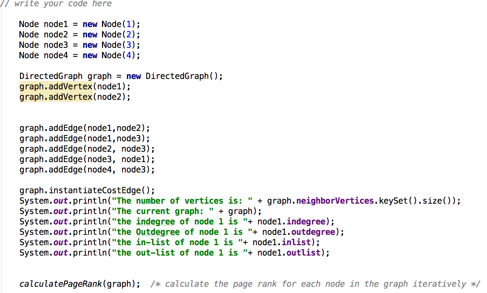

# GraphAPI
GraphApi : calculating PageRank for a given graph.

## Objective :
the goal is to design what you would imagine to be an ideal Graph API and use it for an algorithm implementation.
Here are some basic components and features:
- Generic nodes and edges that can support arbitrary data.
- Graph modification: add/remove nodes, edges.
- Analysis on nodes, edges: in-degree, out-degree, etc.
- Generic algorithms: search, shortest path, span, centrality, connectedness, clustering.

## How To Run :
- Save the *.java files into your package.
- Run on many available IDE's(eclipse or IntelliJ) or the terminal.

## How to create a graph:
### First Create nodes:
- Node node1 = new Node(1);
    - Here 1 is the node number used to create the node object.
- DirectedGraph graph = new DirectedGraph();
- graph.addVertex(node1);
    - Create a Directed Graph object and add the vertex.
- graph.addEdge(node1,node2);
    - This creates an edge from node1 to node2.

## Follow the steps in the screenshot below to create a graph and calculate Pagerank.

